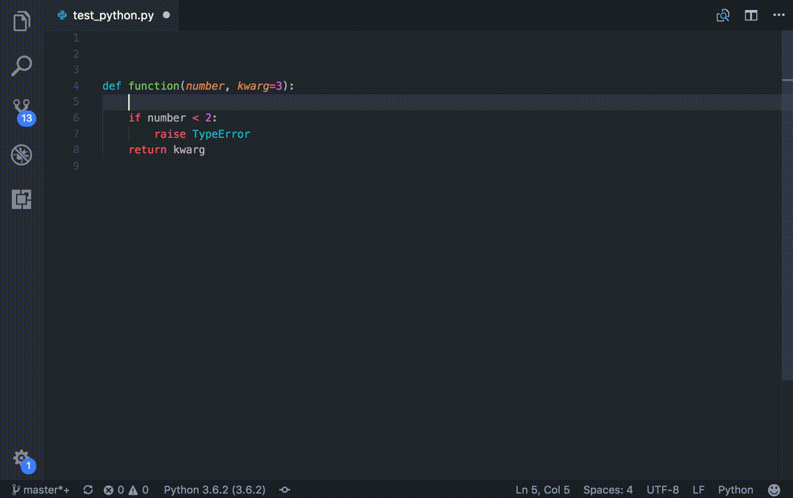
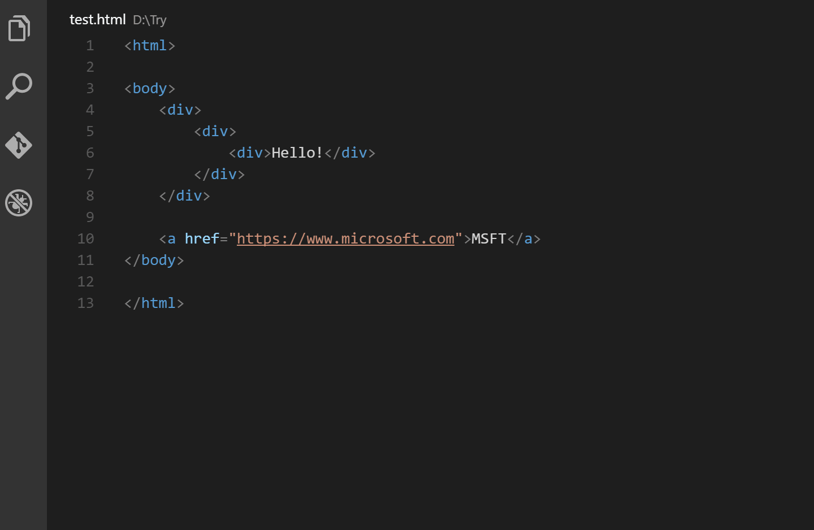
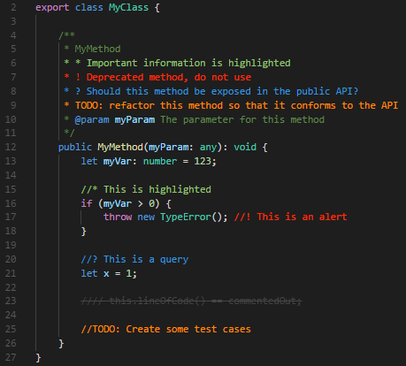

# My Favorite  Visual Studio Code Extensions

Complete list of all my favorite Visual Studio Code extensions that I use all the time.

> This list will be updated on a regular basis as I discover new useful extensions.

<!--------------------------------------------------->

## Table of Contents

- [<b>autoDocstring - Python Docstring Generator</b>](#-autodocstring) -
- [<b>Auto Rename Tag</b>](#-auto-rename-tag) -
- [<b>Better Comments</b>](#-better-comments) - categorize your annotations
- [<b>Bookmarks</b>](#-bookmarks) -
- [<b>Code Spell Checker</b>](#-code-spell-checker) -
- [<b>GitHub Theme</b>](#-github-theme) -
- [<b>HTML End Tag Labels</b>](#-html-end-tag-labels) -
- [<b>Live Server</b>](#-live-server) -
- [<b>markdownlint</b>](#-markdownlint) -
- [<b>Markdown Preview Enhanced</b>](#-markdown-preview-enhanced) -
- [<b>Material Icon Theme</b>](#-material-icon-theme) -
- [<b>Prettier - Code formatter</b>](#-prettier) -
- [<b>Tabnine: AI Autocomplete & Chat for Javascript, Python, Typescript, PHP, Go, Java</b>](#-tabnine) -
- [<b>Todo Tree</b>](#-todo-tree) -
- [<b>YAML</b>](#-yaml) -
 
 
 

<!--------------------------------------------------->

##  autoDocstring

[by Nils Werner](https://github.com/NilsJPWerner)

[Visual Studio Marketplace page](https://marketplace.visualstudio.com/items?itemName=njpwerner.autodocstring)

Visual Studio Code extension to quickly generate docstrings for python functions.

- Quickly generate a docstring snippet that can be tabbed through.
- Choose between several different types of docstring formats.
- Infers parameter types through pep484 type hints, default values, and var names.
- Support for args, kwargs, decorators, errors, and parameter types
 
 

[Back to Table of Contents](#table-of-contents)

<!--------------------------------------------------->

##  Auto Rename Tag

[by Jun Han](https://github.com/formulahendry)

[Visual Studio Marketplace page](https://marketplace.visualstudio.com/items?itemName=formulahendry.auto-rename-tag)

Automatically rename paired HTML/XML tag, same as Visual Studio IDE does.

- When you rename one HTML/XML tag, automatically rename the paired HTML/XML tag.
 
 

[Back to Table of Contents](#table-of-contents)

<!--------------------------------------------------->

##  Better Comments

[by Aaron Bond](https://aaronbond.co.uk/)

[Visual Studio Marketplace page](https://marketplace.visualstudio.com/items?itemName=aaron-bond.better-comments)

The Better Comments extension will help you create more human-friendly comments in your code.
With this extension, you will be able to categorize your annotations into:

- Alerts
- Queries
- TODOs
- Highlights
- Commented out code can also be styled to make it clear the code shouldn't be there
- Any other comment styles you'd like can be specified in the settings
 
 

[Back to Table of Contents](#table-of-contents)

<!--------------------------------------------------->

##  Bookmarks

<!--------------------------------------------------->

##  Code Spell Checker

<!--------------------------------------------------->

##  GitHub Theme

- I prefer the Dark Default color theme

<!--------------------------------------------------->

##  HTML End Tag Labels

<!--------------------------------------------------->

##  Live Server

<!--------------------------------------------------->

##  markdownlint

<!--------------------------------------------------->

##  Markdown Preview Enhanced

<!--------------------------------------------------->

##  Material Icon Theme

<!--------------------------------------------------->

##  Prettier

- Code formatter

<!--------------------------------------------------->

##  Tabnine

- AI Autocomplete & Chat for Javascript, Python, Typescript, PHP, Go, Java

<!--------------------------------------------------->

##  Todo Tree

<!--------------------------------------------------->

##  YAML

- YAML Language Support by Red Hat
