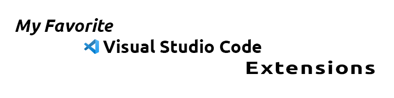
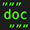

# My Favorite  Visual Studio Code Extensions

Complete list of all my favorite Visual Studio Code extensions that I use all
the time.

> This list will be updated on a regular basis as I discover new useful extensions.

<!--------------------------------------------------->

## Table of Contents

- [<b>Background</b>](#background)
- <b>Extensions:</b>
  - [<b>autoDocstring</b>](#-autodocstring) - quickly generate docstrings for
    python functions
  - [<b>Auto Rename Tag</b>](#-auto-rename-tag) - automatically rename paired
    HTML/XML tag
  - [<b>Better Comments</b>](#-better-comments) - categorize your annotations
  - [<b>Bookmarks</b>](#-bookmarks) - mark lines and jump to them
  - [<b>Code Spell Checker</b>](#-code-spell-checker) - spelling checker for
    source code
  - [<b>GitHub Theme</b>](#-github-theme) - GitHub colors theme
  - [<b>HTML End Tag Labels</b>](#-html-end-tag-labels) - labels HTML end tags
  - [<b>Live SASS Compiler</b>](#-live-sass-compiler) - compile SASS or SCSS to
    CSS at realtime.
  - [<b>Live Server</b>](#-live-server) - launch a local Server for static &
    dynamic pages
  - [<b>markdownlint</b>](#-markdownlint) - Markdown linting and style checking
  - [<b>Markdown Preview Enhanced</b>](#-markdown-preview-enhanced) -
    enhancement of Markdown preview
  - [<b>Material Icon Theme</b>](#-material-icon-theme) - Material design icons
  - [<b>Prettier - Code formatter</b>](#-prettier) - an opinionated code formatter
  - [<b>Tabnine</b>](#-tabnine) - AI powered autocomplete & chat
  - [<b>Todo Tree</b>](#-todo-tree) - Show TODO, FIXME, etc. comment tags in a
    tree view
  - [<b>YAML</b>](#-yaml) - YAML language support by Red Hat
- [<b>Thanks</b>](#thanks) 
 
 

<!--------------------------------------------------->

## Background

 <b>Visual Studio Code has become my primary programming environment.</b>

In order to get all my VS Code extensions sorted, figuring out exactly which ones I use and which I should uninstall until I actually need them, I decided to create this simple repository.

There are a lot of great extensions. As I discover new ones I will add them to this list.

Please feel free to `@me` with any recommendations of your favorite VSC extensions and I'll be sure to check them out!
 
 

[Back to Table of Contents](#table-of-contents)
 
 

<!--------------------------------------------------->

##  autoDocstring

[by Nils Werner](https://github.com/NilsJPWerner)

[Visual Studio Marketplace page](https://marketplace.visualstudio.com/items?itemName=njpwerner.autodocstring)

Visual Studio Code extension to quickly generate docstrings for python functions.

- Quickly generate a docstring snippet that can be tabbed through.
- Choose between several different types of docstring formats.
- Infers parameter types through pep484 type hints, default values, and var names.
- Support for args, kwargs, decorators, errors, and parameter types
 
 

[Back to Table of Contents](#table-of-contents)
 
 

<!--------------------------------------------------->

##  Auto Rename Tag

[by Jun Han](https://github.com/formulahendry)

[Visual Studio Marketplace page](https://marketplace.visualstudio.com/items?itemName=formulahendry.auto-rename-tag)

Automatically rename paired HTML/XML tag, same as Visual Studio IDE does.

- When you rename one HTML/XML tag, automatically rename the paired HTML/XML tag.
 
 

[Back to Table of Contents](#table-of-contents)
 
 

<!--------------------------------------------------->

##  Better Comments

[by Aaron Bond](https://aaronbond.co.uk/)

[Visual Studio Marketplace page](https://marketplace.visualstudio.com/items?itemName=aaron-bond.better-comments)

The Better Comments extension will help you create more human-friendly comments in your code.
With this extension, you will be able to categorize your annotations into:

- Alerts
- Queries
- TODOs
- Highlights
- Commented out code can also be styled to make it clear the code shouldn't be there
- Any other comment styles you'd like can be specified in the settings
 
 

[Back to Table of Contents](#table-of-contents)
 
 

<!--------------------------------------------------->

##  Bookmarks

[by Alessandro Fragnani](https://github.com/alefragnani)

[Visual Studio Marketplace page](https://marketplace.visualstudio.com/items?itemName=alefragnani.Bookmarks)

It helps you to navigate in your code, moving between important positions easily and quickly. No more need to search for code. It also supports a set of selection commands, which allows you to select bookmarked lines and regions between bookmarked lines. It's really useful for log file analysis.

Here are some of the features that Bookmarks provides:

- Mark/unmark positions in your code
- Mark positions in your code and give it name
- Jump forward and backward between bookmarks
- Icons in gutter and overview ruler
- See a list of all Bookmarks in one file and project
- Select lines and regions with bookmarks
- A dedicated Side Bar
 
 

- List all bookmarks from the current file/project and easily navigate to any of them. It shows a line preview and temporarily scroll to its position.

    
 
 

- Select all bookmarked lines. Specially useful while working with log files.

    
 
 

- The Bookmarks extension has its own Side Bar, with a variety of commands to improve you productivity.

    

 
 

[Back to Table of Contents](#table-of-contents)
 
 

<!--------------------------------------------------->

##  Code Spell Checker

[by  Street Side Software](https://github.com/streetsidesoftware)

[Visual Studio Marketplace page](https://marketplace.visualstudio.com/items?itemName=streetsidesoftware.code-spell-checker)

A basic spell checker that works well with code and documents.

The goal of this spell checker is to help catch common spelling errors while keeping the number of false positives low.
 
 

 
 

[Back to Table of Contents](#table-of-contents)
 
 

<!--------------------------------------------------->

##  GitHub Theme

[by Primer](https://github.com/primer)

[Visual Studio Marketplace page](https://marketplace.visualstudio.com/items?itemName=GitHub.github-vscode-theme)

 

> I prefer the Dark Default theme

 

[Back to Table of Contents](#table-of-contents)
 
 

<!--------------------------------------------------->

##  HTML End Tag Labels

[by Ante Primorac](https://github.com/anteprimorac)

[Visual Studio Marketplace page](https://marketplace.visualstudio.com/items?itemName=anteprimorac.html-end-tag-labels)

The HTML End Tag Labels extension for Visual Studio Code is a must-have tool for developers working with HTML-like markup in HTML, JSX, Vue, Svelte, and PHP files. This versatile extension enhances your coding experience by adding clear and visually distinctive labels to the closing tags in these file types.

Whether you're building web applications, working on frontend frameworks, or developing server-side applications, HTML End Tag Labels makes navigating and understanding your code's structure effortless. Say goodbye to tedious tag matching and hello to improved productivity and code readability with this user-friendly extension.

 

 
 

[Back to Table of Contents](#table-of-contents)
 
 

<!--------------------------------------------------->

##  Live SASS Compiler

[by Glenn](https://github.com/glenn2223)

[Visual Studio Marketplace page](https://marketplace.visualstudio.com/items?itemName=glenn2223.live-sass)

Compile SASS and SCSS files to CSS at <i>real-time</i>.

- Live SASS & SCSS compile.
- Customizable file location of exported CSS.
- Customizable exported CSS style (`expanded`, `compressed`).
- Customizable extension name (`.css` or `.min.css`).
- Quick status bar control.
- Exclude specific folders by settings.
- Autoprefix support (See [settings section](https://github.com/glenn2223/vscode-live-sass-compiler/blob/HEAD/docs/settings.md#livesasscompilesettingsautoprefix))
 
 

Click to `Watch Sass` from the status bar to turn on the live compilation and then
click to `Stop Watching Sass` from the status bar to turn off live compilation.
 

 
 

[Back to Table of Contents](#table-of-contents)
 
 

<!--------------------------------------------------->

##  Live Server

[by]()

[Visual Studio Marketplace page]()

Launch a development local Server with live reload feature for static & dynamic pages

- A Quick Development Live Server with live browser reload.
- Start or Stop server by a single click from status bar.
- Open a HTML file to browser from Explorer menu.
- Hot Key control.
- Customizable Port Number, Server Root, default browser.
- Use preferable host name (localhost or 127.0.0.1).
- `https` support.
- Support for proxy.
- Support for any file even dynamic pages through [Live Server Web Extension](https://github.com/ritwickdey/live-server-web-extension).
- <i>and more . . .</i>

 

 
 

[Back to Table of Contents](#table-of-contents)
 
 

<!--------------------------------------------------->

##  markdownlint

[by  David Anson](https://github.com/DavidAnson)

[Visual Studio Marketplace page](https://marketplace.visualstudio.com/items?itemName=DavidAnson.vscode-markdownlint)

The [Markdown](https://en.wikipedia.org/wiki/Markdown) markup language is designed to be easy to read, write, and understand. It succeeds - and its flexibility is both a benefit and a drawback. Many styles are possible, so formatting can be inconsistent. Some constructs don't work well in all parsers and should be avoided.

[markdownlint](https://marketplace.visualstudio.com/items?itemName=DavidAnson.vscode-markdownlint) is an extension for VS Code that includes a library of rules to encourage standards and consistency for Markdown files. It is powered by the [markdownlint library for Node.js](https://github.com/DavidAnson/markdownlint). Linting is performed by the [`markdownlint-cli2` engine](https://github.com/DavidAnson/markdownlint-cli2), which can be used in conjunction with this extension to provide command-line support for scripts and continuous integration scenarios. The [`markdownlint-cli2-action` GitHub Action](https://github.com/marketplace/actions/markdownlint-cli2-action) uses the same engine and can be integrated with project workflows.
 

> Huge help in making my READMEs readable!

 
 

[Back to Table of Contents](#table-of-contents)
 
 

<!--------------------------------------------------->

##  Markdown Preview Enhanced

[by  Yiyi Wang](https://github.com/shd101wyy)

[Visual Studio Marketplace page](https://marketplace.visualstudio.com/items?itemName=shd101wyy.markdown-preview-enhanced)

Markdown Preview Enhanced is an extension that provides you with many useful functionalities listed in its [Documentation](https://shd101wyy.github.io/markdown-preview-enhanced/#/).

> This [Documentation](https://shd101wyy.github.io/markdown-preview-enhanced/#/) is <i>AWESOME!</i>

A lot of its ideas are inspired by [Markdown Preview Plus](https://github.com/atom-community/markdown-preview-plus) and [RStudio Markdown](http://rmarkdown.rstudio.com/).

 

 
 

[Back to Table of Contents](#table-of-contents)
 
 

<!--------------------------------------------------->

##  Material Icon Theme

[by  Philipp Kief](https://github.com/PKief)

[Visual Studio Marketplace page](https://marketplace.visualstudio.com/items?itemName=PKief.material-icon-theme)

 

 

 
 

[Back to Table of Contents](#table-of-contents)
 
 

<!--------------------------------------------------->

##  Prettier

[by Prettier](https://github.com/prettier)

[Visual Studio Marketplace page](https://marketplace.visualstudio.com/items?itemName=esbenp.prettier-vscode)
 

> This one is one of my top favorites.

 

[Prettier](https://prettier.io/) is an opinionated code formatter. It enforces a consistent style by parsing your code and re-printing it with its own rules that take the maximum line length into account, wrapping code when necessary.

By far the biggest reason for adopting Prettier is to stop all the on-going debates over styles. It is generally accepted that having a common style guide is valuable for a project and team but getting there is a very painful and unrewarding process. People get very emotional around particular ways of writing code and nobody likes spending time writing and receiving nits.

So why choose the “Prettier style guide” over any other random style guide? Because Prettier is the only “style guide” that is fully automatic.

[Prettier Documentation](https://prettier.io/docs/en/)

 
 

[Back to Table of Contents](#table-of-contents)
 
 

<!--------------------------------------------------->

##  Tabnine

[by Tabnine](https://github.com/codota)

[Visual Studio Marketplace page](https://marketplace.visualstudio.com/items?itemName=TabNine.tabnine-vscode)
 

> Another one of my top favorites.

 

Tabnine is an AI code assistant that makes you a better developer. Tabnine will increase your development velocity with real-time code completions, chat, and code generation in all the most popular coding languages and IDEs.

Whether you call it IntelliSense, intelliCode, autocomplete, AI-assisted code completion, AI-powered code completion, AI copilot, AI code snippets, code suggestion, code prediction, code hinting, content assist, unit test generation or documentation generation, using Tabnine can massively impact your coding velocity, significantly cutting down your coding time.

Tabnine supports all major languages including JavaScript, Python, Java, Typescript c/c++ and more.

 

 

 
 

[Back to Table of Contents](#table-of-contents)
 
 

<!--------------------------------------------------->

##  Todo Tree

[by Nigel Scott](https://github.com/Gruntfuggly)

[Visual Studio Marketplace page](https://marketplace.visualstudio.com/items?itemName=Gruntfuggly.todo-tree)

This extension quickly searches (using [ripgrep](https://github.com/BurntSushi/ripgrep)) your workspace for comment tags like TODO and FIXME, and displays them in a tree view in the activity bar. The view can be dragged out of the activity bar into the explorer pane (or anywhere else you would prefer it to be).

Clicking a TODO within the tree will open the file and put the cursor on the line containing the TODO.

Found TODOs can also be highlighted in open files.

<i>Please see the [wiki](https://github.com/Gruntfuggly/todo-tree/wiki/Configuration-Examples) for configuration examples.</i>

 

 
 

[Back to Table of Contents](#table-of-contents)
 
 

<!--------------------------------------------------->

##  YAML

[by Red Hat Developer](https://github.com/redhat-developer)

[Visual Studio Marketplace page](https://marketplace.visualstudio.com/items?itemName=redhat.vscode-yaml)

> YAML is my favorite markup language! It's so clean of brackets!

This extension provides comprehensive YAML Language support to VS Code, via the [yaml-language-server](https://github.com/redhat-developer/yaml-language-server), with built-in [Kubernetes](https://kubernetes.io/) syntax support.

<b>Features:</b>

- YAML validation:
  - Detects whether the entire file is valid yaml
  - Detects errors such as:
    - Node is not found
    - Node has an invalid key node type
    - Node has an invalid type
    - Node is not a valid child node
- Document Outlining (Ctrl + Shift + O):
  - Provides the document outlining of all completed nodes in the file
- Auto completion (Ctrl + Space):
  - Auto completes on all commands
  - Scalar nodes autocomplete to schema's defaults if they exist
- Hover support:
  - Hovering over a node shows description if provided by schema
- Formatter:
  - Allows for formatting the current file
  - On type formatting auto indent for array items

 

 
 

[Back to Table of Contents](#table-of-contents)
 
 

<!--------------------------------------------------->

## Thanks

YouTube videos that have inspired my adoption of many of these extentions:

- [Visual Studio Code Crash Course](https://youtu.be/WPqXP_kLzpo?si=KPTufOEaaZ6vnAo0)
- [Visual Studio Code Extensions to Improve Your Productivity](https://youtu.be/g1vy03ZY5mM?si=IvIKIiWncGfG0JRG)
- [Best VSCode extensions in 2023](https://youtu.be/DNf6Bu7z4vw?si=N_z30N6glKtfjr49)
 
 

[Back to Table of Contents](#table-of-contents)
